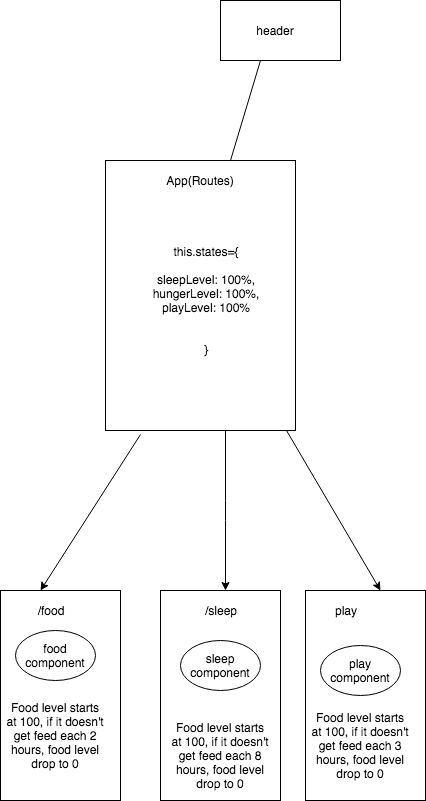

# **Tamagotchi React**

#### By Sean McDermott and Adriana Chen

## Description
* This is a 2-day project working on building a functioning Tamagotchi with React.js.

## Component Tree

## Specifications

### Completed
* User should be able to feed
* User should be able to put to sleep
* User should be able to play

## Setup/Installation Requirements

* To view project code, _clone repository from_ http
* Install Node.js
* Open terminal, navigate to project root directory and run npm install.

## Development server

Run `npm run start` for a dev server. Navigate to `http://localhost:8080/`. The app will automatically reload if you change any of the source files.

## Notes

## Known Bugs

## Technologies Used

* HTML
* CSS
* React
* Javascript
* Material-UI

## Further help

## License

* MIT

Sean McDermott © 2018
